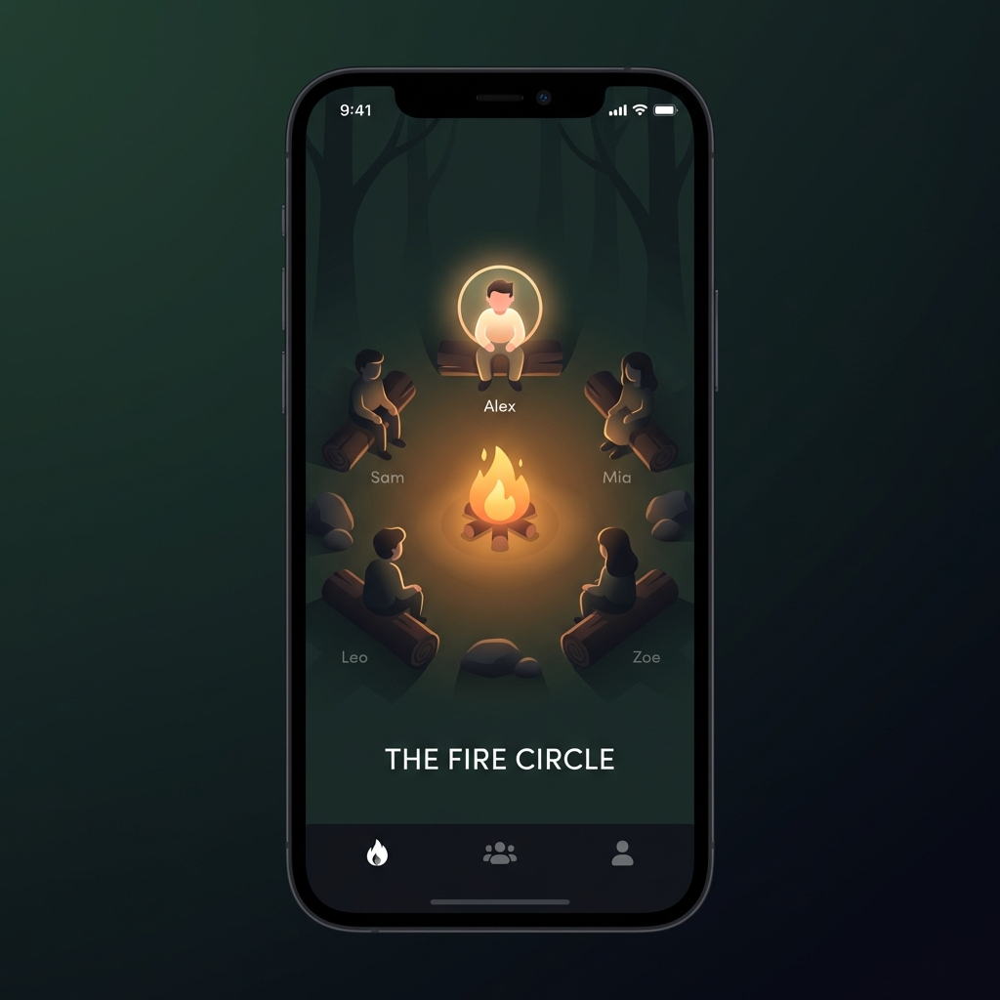

# Design Pivot: Home Screen Concepts

To address the feedback for a "unique, designerly" approach that is "cozy outdoors" but less "fantasy", here are two radical concepts for the Home Screen.

## Option A: The Fire Circle (Rotary UI)
The user sits at the fire. Friends sit around them. You rotate the circle to "face" a friend.
**Vibe**: Intimate, grounded, warm.
**Interaction**: Drag/Rotate the ring.
````carousel

````

## Option B: The Constellations (Spatial UI)
Friends are stars in the night sky. The distance between you and them is visual.
**Vibe**: Calm, vast, clean, premium.
**Interaction**: Pan and Zoom the sky.
````carousel

````

## Option C: The Trail (Vertical Timeline)
(No image yet). A winding path through a forest. Friend's faces are mile-markers along the trail.
**Vibe**: Journey-focused, linear.
**Interaction**: Vertical scroll.

Please let me know which concept resonates for the "Designerly" Home Screen.
