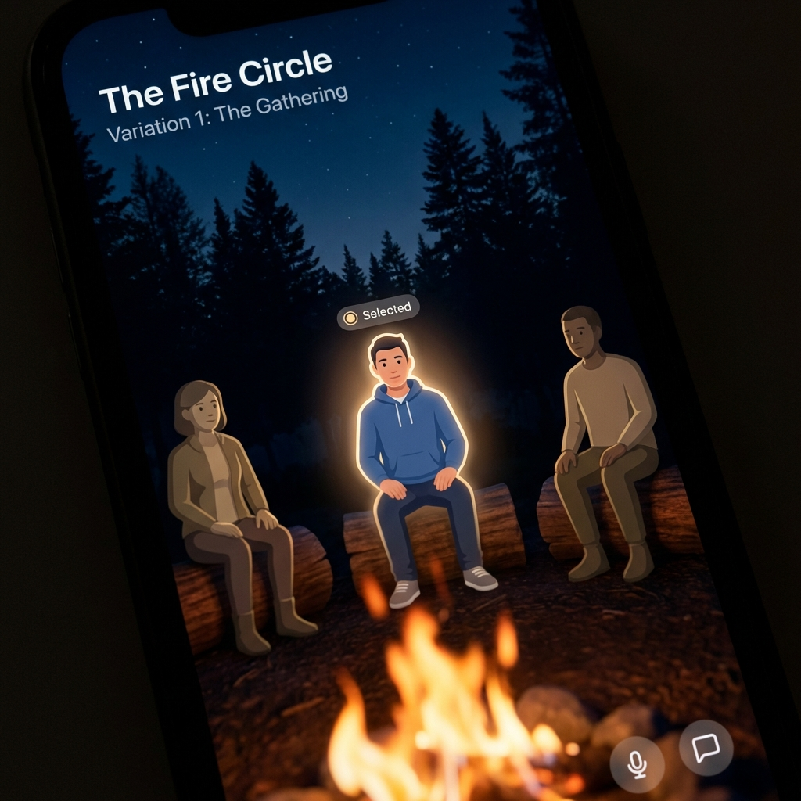

# Fire Circle: Design Iterations

We are locking in on the **Fire Circle** concept. Here are two distinct execution paths.

## Variation 1: The Gathering (Immersive)
**Perspective**: First-person, looking across the fire at your friends.
**Visuals**: High fidelity, depth of field, blurred foreground flames.
**Feel**: "I am camping with my friends right now."
````carousel

````

## Variation 2: The Ember Dial (Functional)
**Perspective**: Top-down, abstract.
**Visuals**: Clean vector graphics, "Click-wheel" style rotary interface.
**Feel**: "Premium utility app with a warm soul."
````carousel

````

Which direction resonates more for the final spec?
