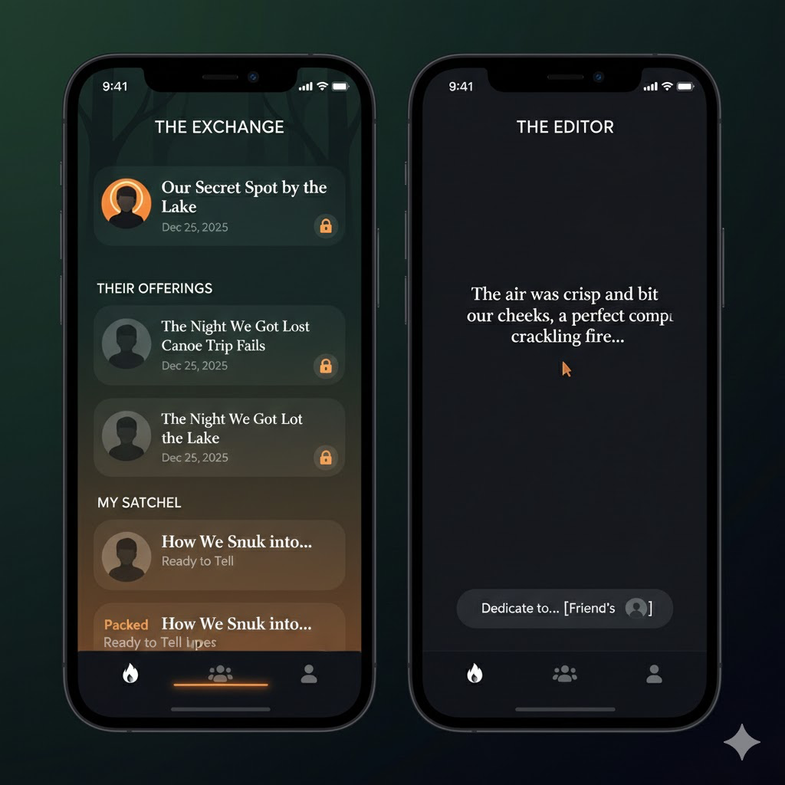

# Final Reference: Exchange & Editor

The user has selected a **Modern Cozy / Dark Mode** aesthetic.
Reference the image below for the implementation of the **Exchange** and **Editor** views.

## Key Visuals
*   **The Exchange**: Split list view ("Their Offerings" vs "My Satchel"). Dark rounded cards. Lock icons for hidden content.
*   **The Editor**: Ultra-minimal dark background. Serif white text. "Dedicate to..." pill at the bottom.

````carousel

````
